<picture>
  <source media="(prefers-color-scheme: dark)" srcset="./dark.svg">
  <source media="(prefers-color-scheme: light)" srcset="./light.svg">
  
</picture>

## Sobre

Desenvolvedora Back-End, formada em Análise e Desenvolvimento de Sistemas (ADS) e atualmente cursando IA e Machine Learning. Baseada em Brasília - DF, com foco atual em desenvolvimento Back-End.

## Stack

## GitHub stats

---

Feito com 💙 por [DevCoder Systems](https://devcodersystems.tech)
